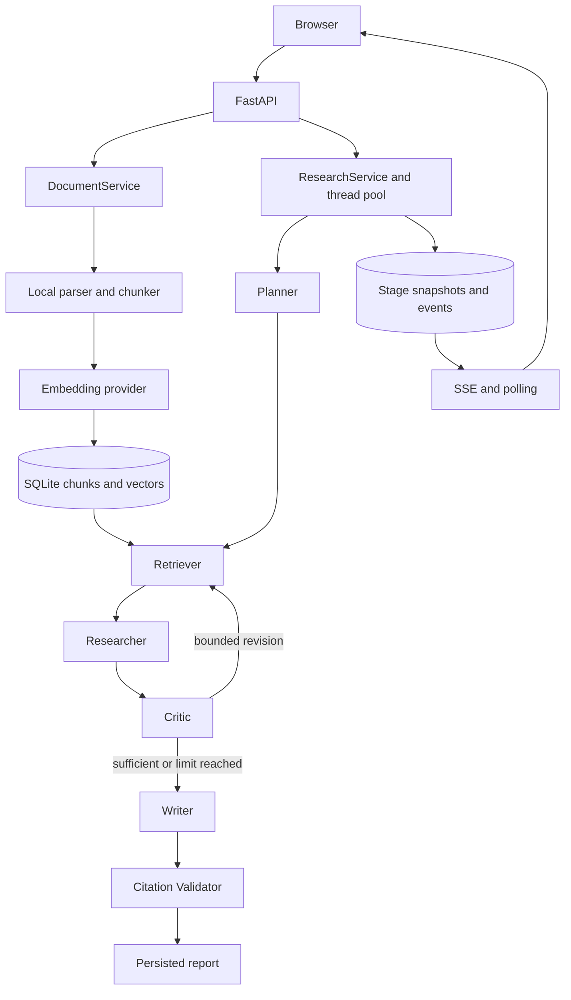

# Architecture

The implemented system is a Python monolith. FastAPI serves both the API and
static HTML/CSS/JavaScript. Services own persistence; agents receive typed state
and provider interfaces. No agent directly reads `.env` or handles HTTP requests.

## Boundaries and storage

| Module | Responsibility |
| --- | --- |
| `app/api`, `app/main.py` | Validation, uploads, errors, lifecycle, API/SSE and UI routes |
| `app/services` | Document ingestion/deletion and research execution/recovery |
| `app/retrieval` | Local loading, chunks, embedding, NumPy cosine search, reciprocal rank fusion |
| `app/agents`, `app/workflow` | Structured plans/synthesis/critique/drafts, routing, snapshots, citations |
| `app/providers` | Fake and OpenAI compatible chat/embedding interfaces, retries, metadata |
| `app/storage` | SQLite records, float32 vector blobs, uploaded file confinement |
| `app/evaluation` | Dataset validation, workflow adapters, isolated traces, metrics, reports and gates |

SQLite stores document metadata, chunk text and model-tagged vectors, runs,
state, events, and reports. Uploaded bytes are stored separately under the
configured upload directory. The local index reads selected documents from the
repository and computes normalized cosine scores in NumPy; it is not a separate
vector database. Retrieval fuses the original question and bounded expanded
queries while retaining evidence identity, filename, page, and chunk index.

PDF parsing extracts local text with pypdf; it does not perform OCR. UTF-8
Markdown/TXT documents have no page number. The API validates extension/MIME,
streamed upload limits, and filenames before ingestion. Default limits are
20 MiB per file and 50 MiB of file content per request, configured in `app/config.py`.

## Workflow and recovery

Planner produces search queries and completion criteria. Researcher binds
findings to retrieved evidence IDs. Critic combines provider judgement with
deterministic support-ID and literal completion-criteria checks. By default it
can request two further retrieval rounds, with a separate 24-step graph limit.
At the revision bound, Writer can produce a report marked `evidence_sufficient=false`.

Writer emits structured report data and Markdown citation tokens. The final
validator rejects malformed tokens, unknown IDs, and declared citations missing
from the Markdown, then creates source excerpts and anchors. These checks
establish citation integrity, not semantic entailment or factual correctness.

Each wrapped node persists stage events and its completed state update. Startup
reschedules incomplete runs; graph entry routing resumes from persisted state.
A provider call interrupted before its completed checkpoint can run again.
This is recovery at stage boundaries, not exactly-once external execution.
The in-process task manager uses a thread pool with two workers by default;
there is no cross-process lease or distributed job queue. Run one application
process against a given local database.

## Provider and browser behavior

Chat and embedding providers are configured separately. Both real integrations
use `OpenAICompatibleChatProvider` / `OpenAICompatibleEmbeddingProvider` with
different URLs, keys, and model names. Fake chat generates schema-aware,
deterministic evidence-based output; fake embeddings use local hashing.
Timeout, bounded retries, structured response repair, and safe error codes live
at provider boundaries.

The browser consumes named `workflow` SSE events and uses polling on stream
failure. Server-side sequence numbers support replay; `/api/research/{id}` is
the source of persisted run/report state. Report rendering uses DOM text nodes
and constrained Markdown handling instead of trusting arbitrary model HTML.
The application provides neither authentication nor authorization. See
[privacy guidance](../README.md#privacy-and-development) before enabling real providers.
